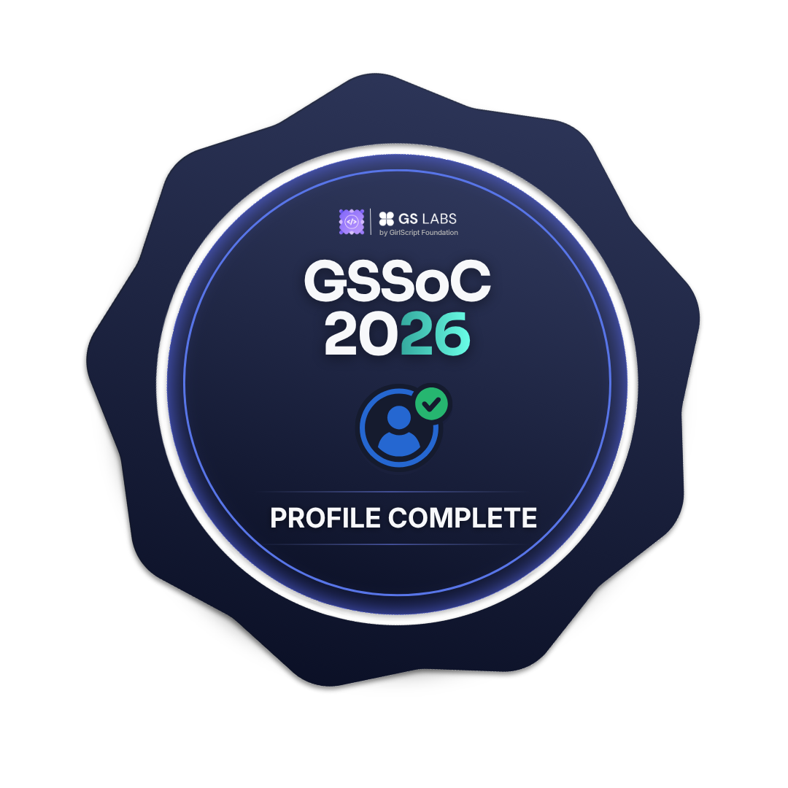

# Hi there, I'm Nishtha Singh 👋

An enthusiastic **B.Tech Computer Science student** passionate about **Data Science, Machine Learning, and building clean data pipelines**. Currently expanding my skillset through corporate exposure and global open-source collaborations.

---

### 💻 Tech Stack & Interests
- **Languages & Frameworks:** Python, Pandas, NumPy, Scikit-Learn
- **Core Focus:** Exploratory Data Analysis (EDA), Financial Data Analytics, Data Automation Tools
- **Current Engagement:** Active Contributor & Ambassador at **GSSoC '26** 🚀

---

### 🏅 GSSoC '26 Open Source Milestones

  
  
  
  
  
  
  

---

### 🚀 About Me
- 🎓 **Education:** B.Tech Computer Science & Engineering student at **Government Mahila Engineering College, Ajmer**.
- 💼 **Current Role:** Data Science Intern at **Q Degree**.
- 🎯 **Vision:** *“Turning raw datasets into meaningful financial and business insights, one pipeline at a time.”*

---

*“Turning raw datasets into meaningful financial and business insights, one pipeline at a time.”*
